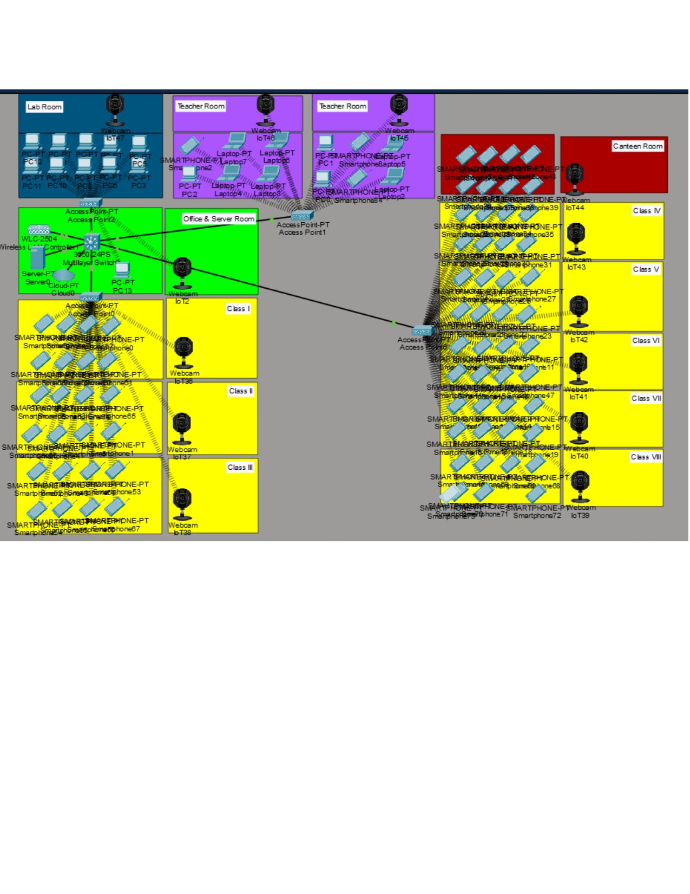
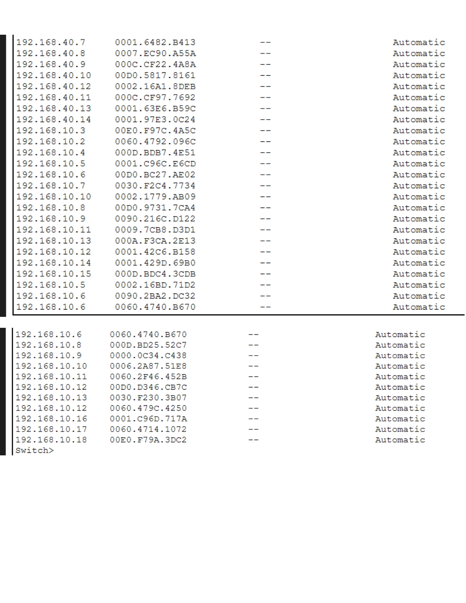
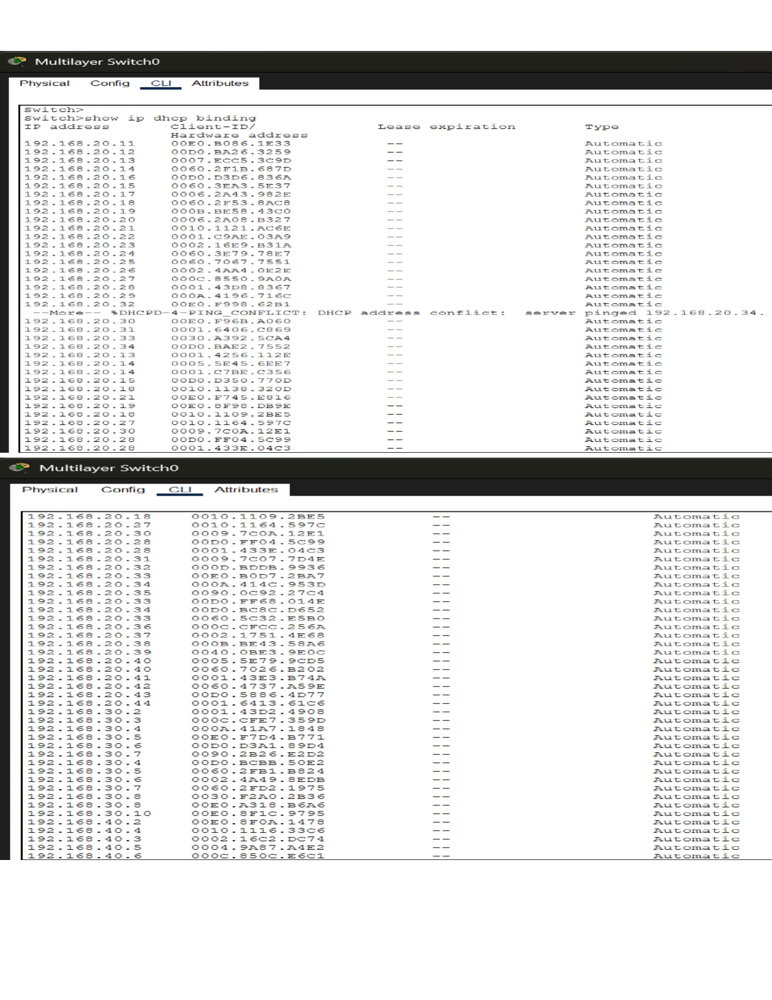
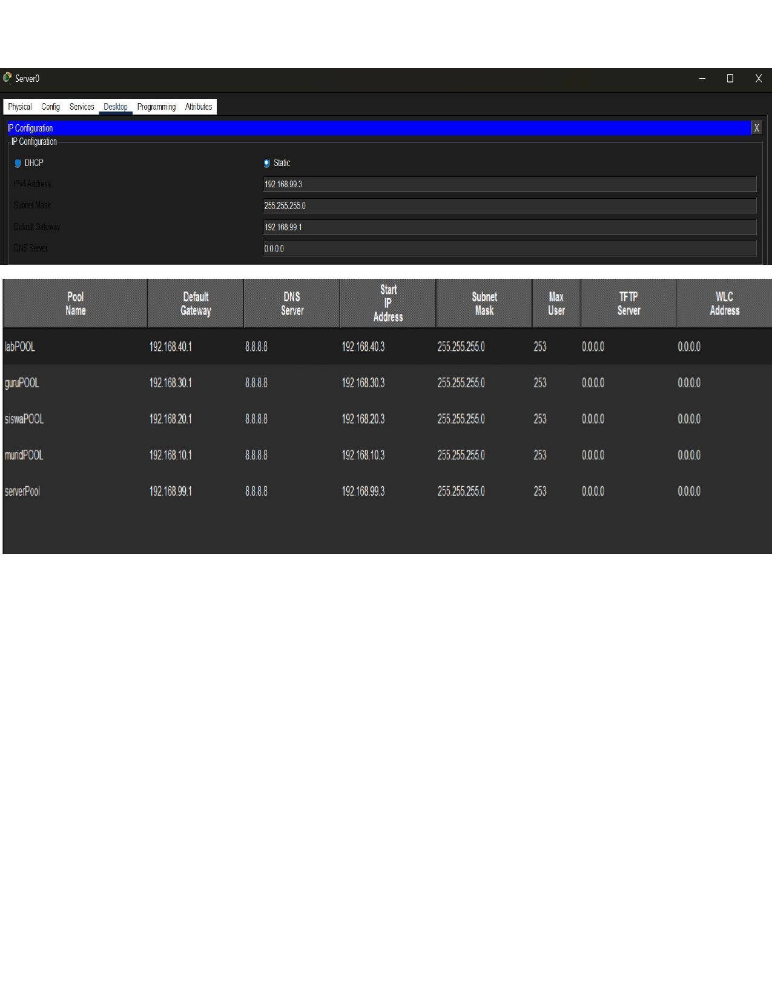
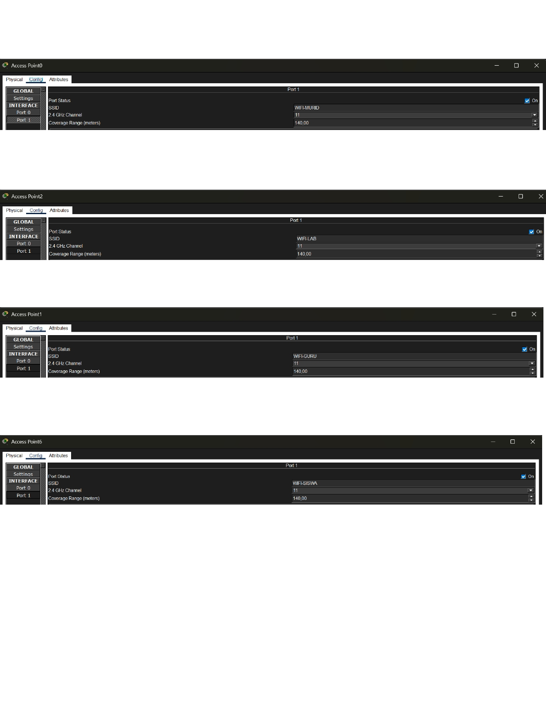
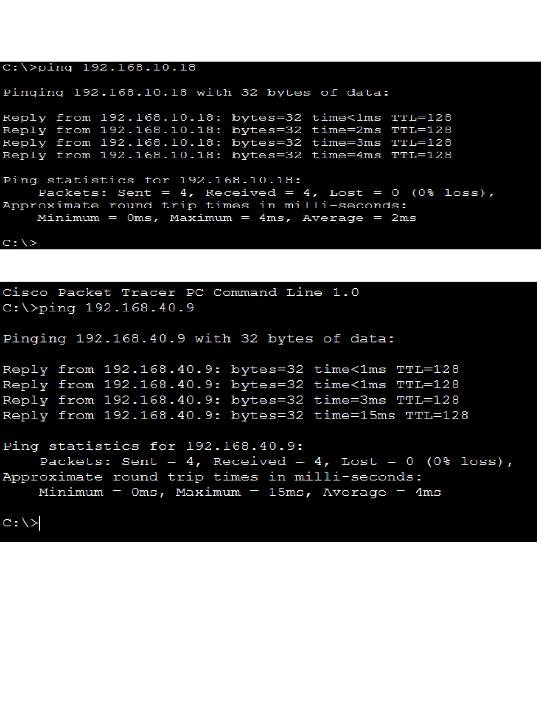
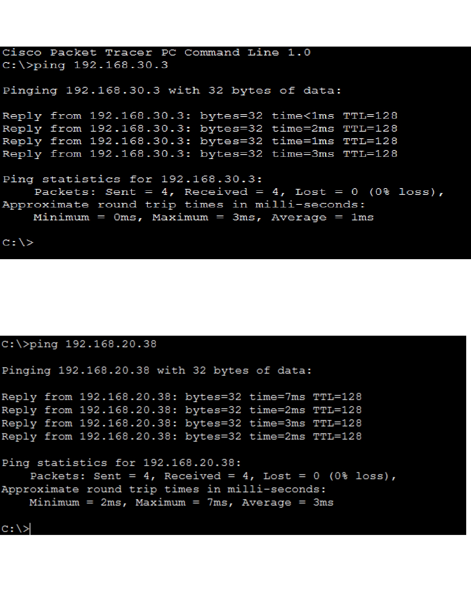

# Cisco School Network


A Cisco Packet Tracer simulation project that demonstrates the implementation of a **school-wide network infrastructure** with multiple network segments, automatic IP address allocation, wireless connectivity, and end-to-end communication testing.

---

# 📖 Project Overview

This project was developed to simulate a real-world school network environment using Cisco Packet Tracer.

The network is divided into multiple sections including classrooms, laboratories, teacher rooms, management offices, and server rooms. Every segment is assigned its own subnet while maintaining communication across the network.

The implementation includes DHCP services for automatic IP assignment, Wireless Access Point configuration, and successful connectivity verification using ICMP (Ping).

---

# ✨ Features

- School-wide network topology
- Multiple subnet implementation
- DHCP Server configuration
- Automatic IP Address Assignment
- Wireless Access Point configuration
- End-to-End connectivity testing
- IPv4 network segmentation
- Cisco Packet Tracer simulation

---

# 🛠 Technologies

- Cisco Packet Tracer
- IPv4 Addressing
- DHCP
- Wireless Access Point
- LAN Networking
- ICMP (Ping)

---

# 🌐 Network Segmentation

| Network | Subnet | Purpose |
|----------|---------|---------|
| Management | 192.168.99.0/24 | Network Management & Server |
| Laboratory | 192.168.40.0/24 | Computer Laboratory |
| Teacher Room | 192.168.30.0/24 | Teachers & Staff |
| Classroom Right | 192.168.20.0/24 | Students |
| Classroom Left | 192.168.10.0/24 | Students |

---

# 🗺 Network Topology

### Overall Network Design




---

# ⚙ Configuration Preview

## DHCP Binding

Automatic IP Address allocation successfully assigned to connected devices.





---

## DHCP Pool

Configured DHCP pools for every network segment.



---

## Wireless Access Point

Wireless Access Point configured to provide wireless connectivity within the school environment.




---

## Connectivity Testing

End-to-end communication successfully verified using ICMP Ping.





---

# 📂 Repository Structure

```text
cisco-school-network
│
├── README.md
├── School_Wide_Network.pdf
├── School_Wide_Network.pkt
│
└── images/
    ├── topology-1.jpg
    ├── topology-2.jpg
    ├── dhcp-binding-1.jpg
    ├── dhcp-binding-2.jpg
    ├── dhcp-pool.jpg
    ├── access-point-config-1.jpg
    ├── access-point-config-2.jpg
    ├── ping-test-1.jpg
    └── ping-test-2.jpg
```

---

# 🚀 How to Run

1. Install Cisco Packet Tracer.
2. Open **School_Wide_Network.pkt**.
3. Wait until the simulation loads completely.
4. Verify DHCP address allocation.
5. Test communication between devices using **Ping**.
6. Review the wireless network configuration.

---

# 📄 Documentation

The complete project documentation is available in:

- **School_Wide_Network.pdf**

---

# 👨‍💻 Authors

- Aldi Syarif Alhakim
- Alezuna M. Nadhif Pohan
- Muhamad Ihsad Rasyad

---

## ⭐ If you found this project interesting, feel free to give it a star.
